# Лабораторная работа: Асинхронное программирование в FastAPI

## Задание 1. Подготовительный этап: создание проекта и первого коммита

1. Создайте новую директорию для проекта, назовите её `фамилия_инициалы_async` (например, `ivanov_ii_async`) и перейдите в неё.   
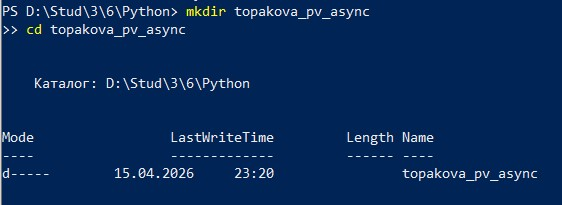   
2. Инициализируйте git-репозиторий: `git init`.   
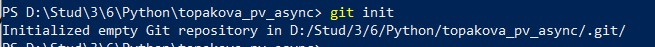   
3. Создайте файл `.gitignore` и добавьте стандартные исключения для Python-проектов (шаблон: https://github.com/github/gitignore/blob/main/Python.gitignore).
   
   
4. Инициализируйте проект при помощи uv: `uv init`.   
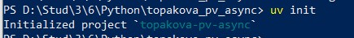   
5. Создайте виртуальное окружение и установите необходимые пакеты:
   - `uv venv`
   - активация для Linux/macOS: `source .venv/bin/activate`
   - активация для Windows: `.venv\Scripts\activate`
   - `uv add fastapi uvicorn httpx pydantic-settings`
   Проверьте файл `pyproject.toml` – зависимости должны появиться в `[project.dependencies]`.   
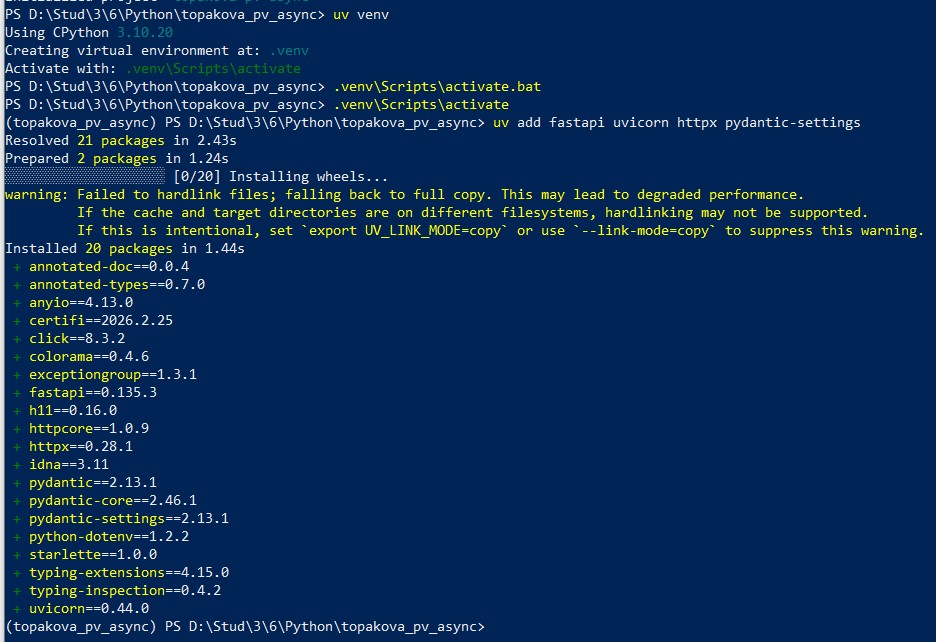   
6. Создайте структуру директорий:
   - `app/`
     - `__init__.py`
     - `main.py`
     - `config.py`
     - `tasks.py` (имитация длительных задач)
     - `storage.py` (хранилище статусов задач в памяти)
     - `routers/`
       - `__init__.py`
       - `tasks.py` (эндпоинты для работы с задачами)
       - `websocket.py` (WebSocket эндпоинты)   
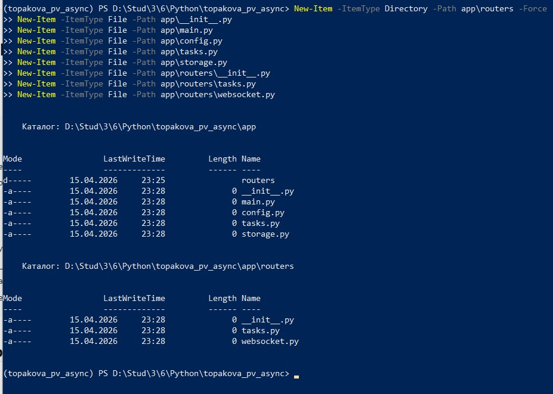   
7. В `app/config.py` создайте минимальный класс настроек (используйте `pydantic_settings.BaseSettings`, поле `app_name`, поддержка `.env` файла).   
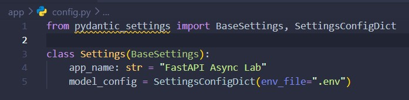   
8. В `app/main.py` создайте минимальное приложение FastAPI: импортируйте настройки, подключите роутеры задач и веб-сокетов, добавьте корневой эндпоинт `GET /`.   
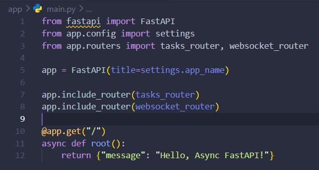   
9. Запустите приложение: `uvicorn app.main:app --reload`. Откройте http://127.0.0.1:8000/docs – документация должна быть доступна.   
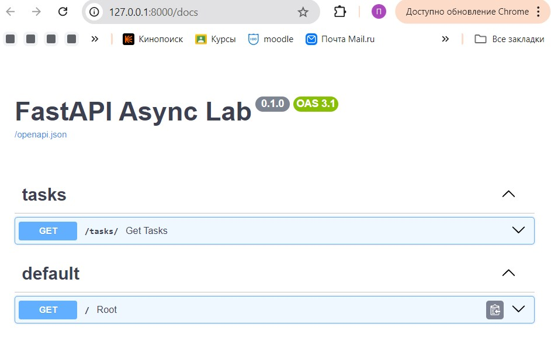   
10. Сделайте первый коммит:
    - `git add .gitignore pyproject.toml uv.lock .python-version app/`
    - `git commit -m "init: базовое FastAPI приложение"`   
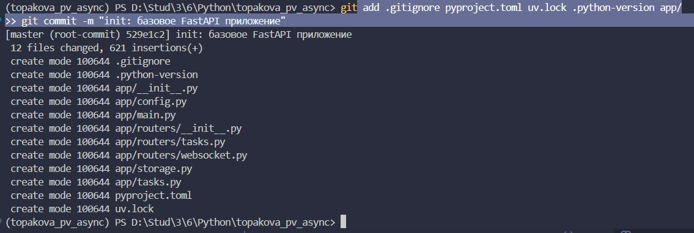   

## Задание 2. Фоновые задачи (BackgroundTasks)

**Цель:** Реализовать отправку email-уведомления в фоне после получения ответа от API.

1. В файле `app/routers/tasks.py` создайте роутер с префиксом `/notify` и тегом `notifications`. Опишите синхронную функцию `send_email`, имитирующую отправку письма (например, с `time.sleep(2)` и выводом в консоль). Добавьте эндпоинт `POST /email`, который через `BackgroundTasks` запускает `send_email` и сразу возвращает статус.   
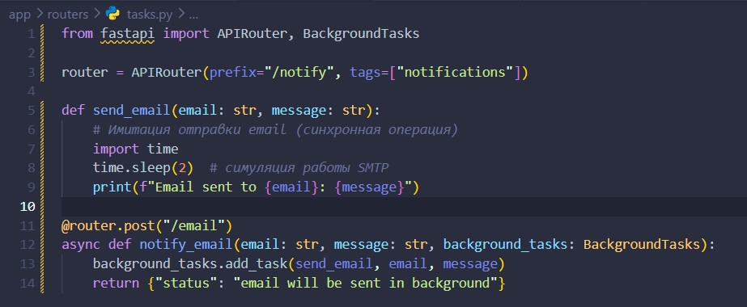   
2. В `app/routers/__init__.py` импортируйте этот роутер как `tasks_router`, а также заглушку для `websocket_router`.   
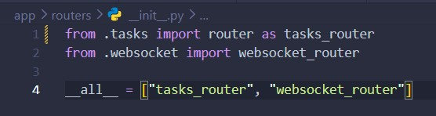   
3. Проверьте через Swagger UI: POST-запрос к `/notify/email` с параметрами `email` и `message`. Ответ мгновенный, в консоли через 2 секунды сообщение.   
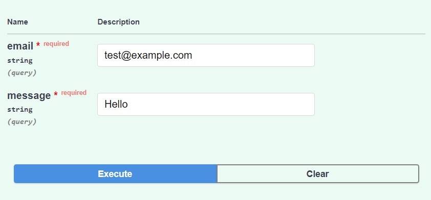   
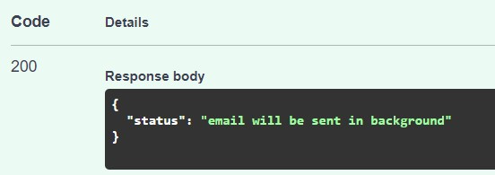   
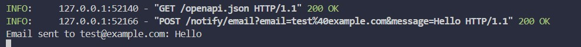   
4. Сделайте коммит:
   - `git add app/routers/tasks.py app/routers/__init__.py app/main.py`
   - `git commit -m "feat: добавлена фоновая отправка email через BackgroundTasks"`   
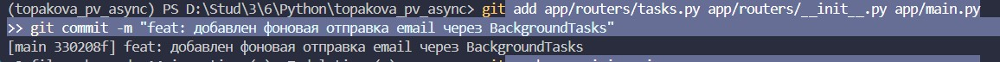   

## Задание 3. Длительная задача с опросом статуса (polling)

**Цель:** Реализовать эндпоинт для запуска длительной задачи (имитация обработки изображения), возвращающий `task_id`. Клиент может опрашивать статус по `task_id` и получить результат после завершения.

1. Создайте `app/storage.py` – хранилище задач в памяти (словарь). Реализуйте функции:
   - `create_task()` – генерирует UUID, создаёт запись со статусом `pending`.
   - `update_task(task_id, status, result=None)` – обновляет статус и результат.
   - `get_task(task_id)` – возвращает задачу или `None`.   
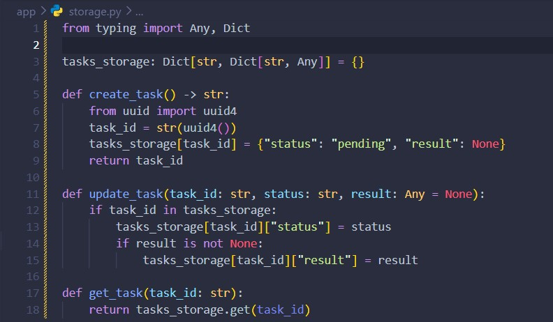   
2. В `app/tasks.py` создайте асинхронную функцию `long_running_task(task_id, input_data)`. Имитируйте длительную обработку (например, 10 шагов с паузой 1 сек), обновляйте прогресс через `update_task`, по завершении – статус `completed` с результатом. Обработайте исключения, устанавливая статус `error`.   
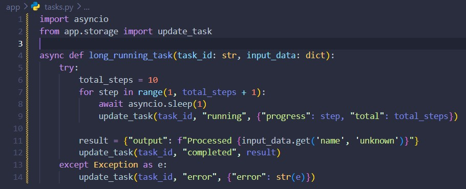   
3. В `app/routers/tasks.py` добавьте новый роутер с префиксом `/tasks` и тегом `long tasks`. Определите эндпоинты:
   - `POST /process` – принимает JSON с входными данными, создаёт задачу, запускает `long_running_task` через `BackgroundTasks`, возвращает `task_id`.
   - `GET /{task_id}` – возвращает состояние задачи или 404.   
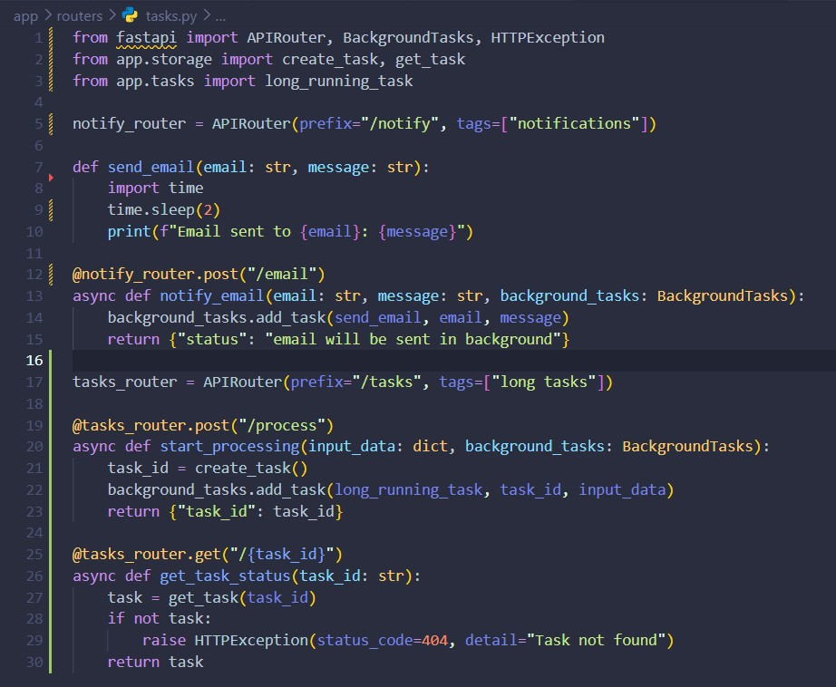   
4. Проверьте: создайте задачу (`POST /tasks/process` с JSON `{"name": "test"}`), опрашивайте статус. Должны видеть смену статусов `pending` → `running` (с прогрессом) → `completed`.   
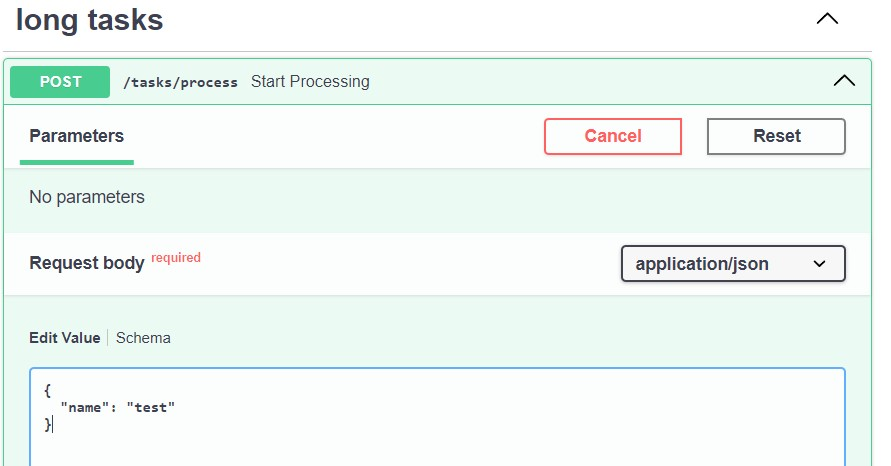   
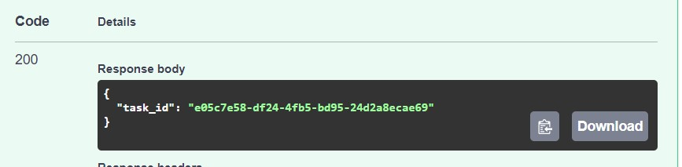   
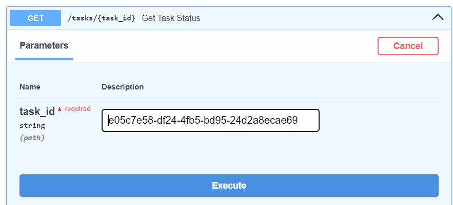   
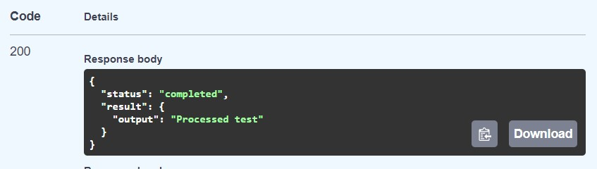   
5. Сделайте коммит:
   - `git add app/storage.py app/tasks.py app/routers/tasks.py`
   - `git commit -m "feat: добавлена длительная задача с опросом статуса"`   
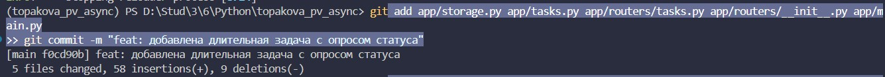   

## Задание 4. Запуск синхронного кода в асинхронном контексте

**Цель:** Показать, как правильно вызывать синхронные блокирующие функции (CPU-bound вычисления) внутри асинхронного эндпоинта, не блокируя event loop, с помощью `asyncio.to_thread`.

1. В `app/tasks.py` добавьте синхронную функцию `sync_cpu_bound(data: dict) -> dict`. Используйте `time.sleep(3)` для имитации вычислений, возвращайте `{"computed": data.get("value", 0) * 2}`.   
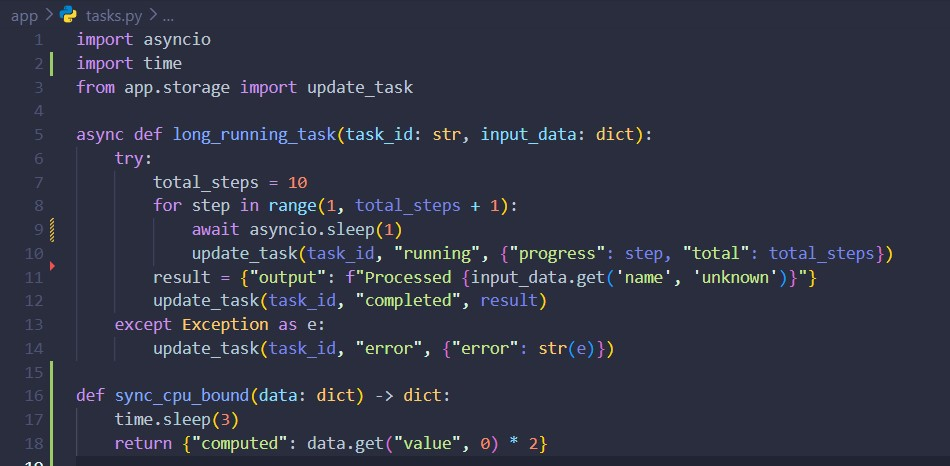   
2. В `app/routers/tasks.py` добавьте эндпоинт `POST /tasks/compute`. Принимайте JSON, запускайте `sync_cpu_bound` через `await asyncio.to_thread(...)`, возвращайте результат.   
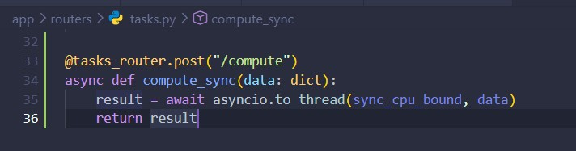   
3. Проверьте: `POST /tasks/compute` с `{"value": 21}` → ответ `{"computed": 42}`. Во время 3-секундной паузы сервер должен обрабатывать другие запросы.   
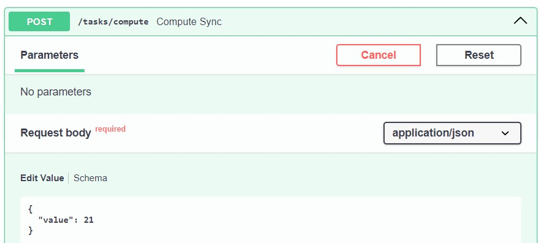   
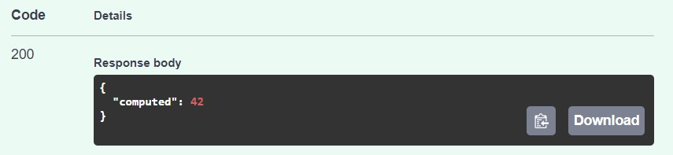   
4. Сделайте коммит:
   - `git add app/tasks.py app/routers/tasks.py`
   - `git commit -m "feat: запуск синхронного CPU-bound кода через asyncio.to_thread"`   
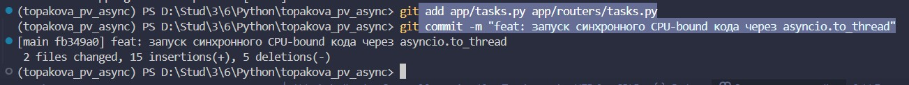   

## Задание 5. WebSocket для real-time обновлений прогресса задачи

**Цель:** Реализовать WebSocket эндпоинт, который подключается к задаче и отправляет клиенту обновления статуса в реальном времени.

1. Создайте `app/routers/websocket.py`. Определите роутер с тегом `websocket`. Добавьте WebSocket-эндпоинт по пути `/ws/task/{task_id}`:
   - Примите соединение.
   - В цикле с интервалом (например, 1 сек) получайте задачу из хранилища.
   - Если задача не найдена – отправьте ошибку и закройте соединение.
   - Отправляйте текущее состояние задачи.
   - Если статус `completed` или `error` – прервите цикл.
   - Обработайте `WebSocketDisconnect`.   
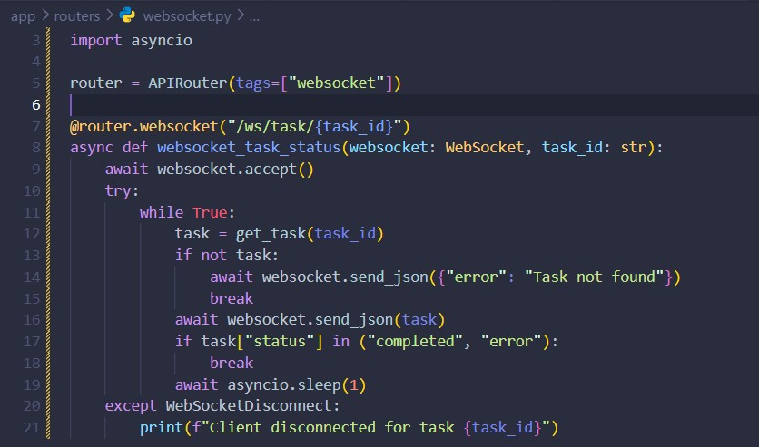   
2. Обновите `app/routers/__init__.py`, чтобы экспортировать `websocket_router`.   
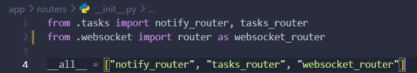   
3. Проверьте: используйте WebSocket-клиент, подключитесь к `ws://localhost:8000/ws/task/{task_id}` (предварительно создав задачу через `POST /tasks/process`). Должны приходить обновления статуса.   
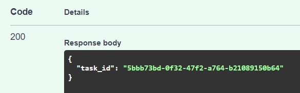   
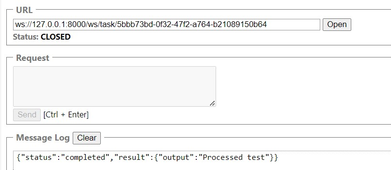   
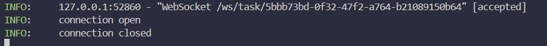   
4. Сделайте коммит:
   - `git add app/routers/websocket.py app/routers/__init__.py`
   - `git commit -m "feat: добавлен WebSocket для real-time статуса задачи"`   
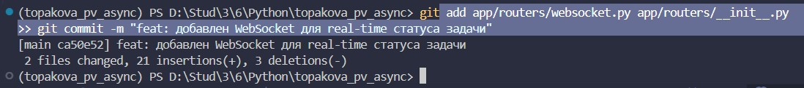   

## Задание 6. Самостоятельная работа

Каждый пункт должен быть отдельным коммитом с соответствующим префиксом (`feat`, `refactor`, `test` и т.д.).

### 6.1. Добавьте очередь задач
- Используйте `asyncio.Queue` для постановки задач в очередь и создайте отдельный воркер (фоновую корутину), который обрабатывает задачи последовательно.
- Модифицируйте эндпоинт `/tasks/process` так, чтобы задача попадала в очередь, а не запускалась сразу.
- Покажите, что при большом количестве запросов задачи не запускаются одновременно, а ждут своей очереди.
   
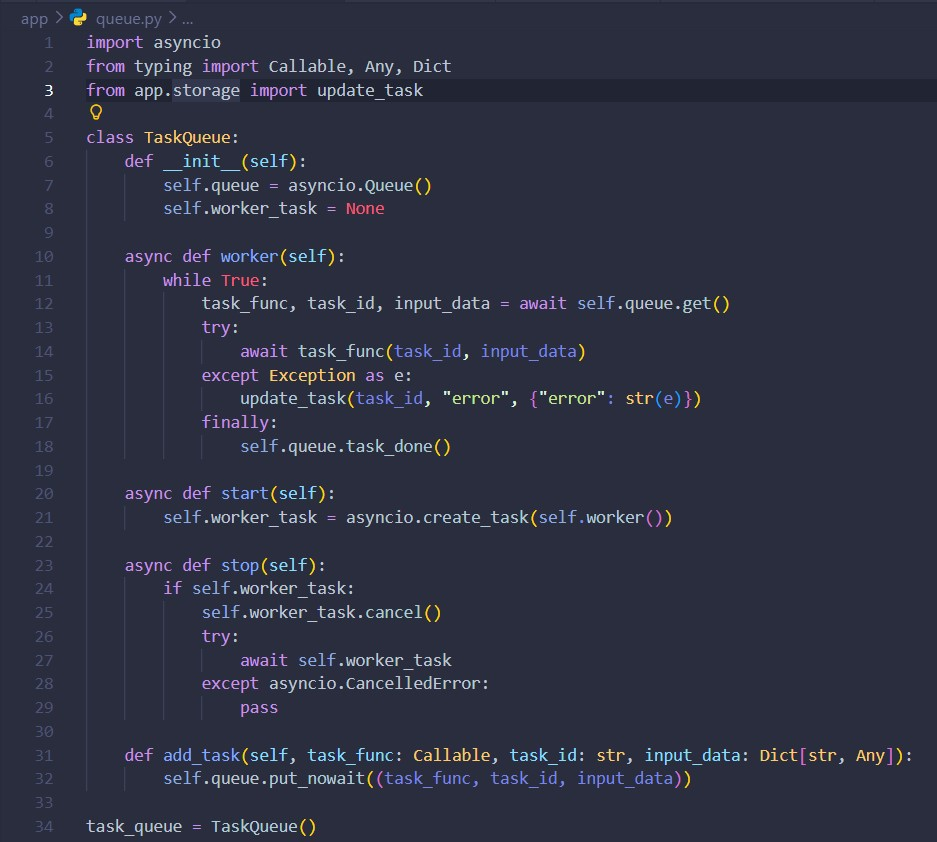   
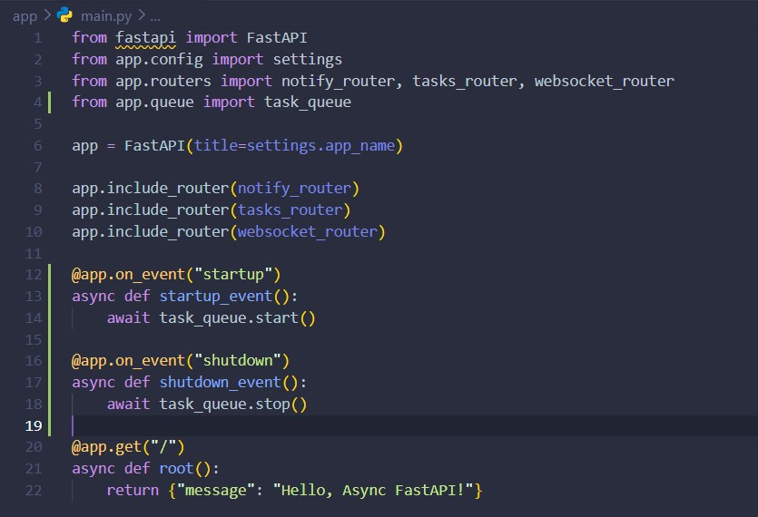   
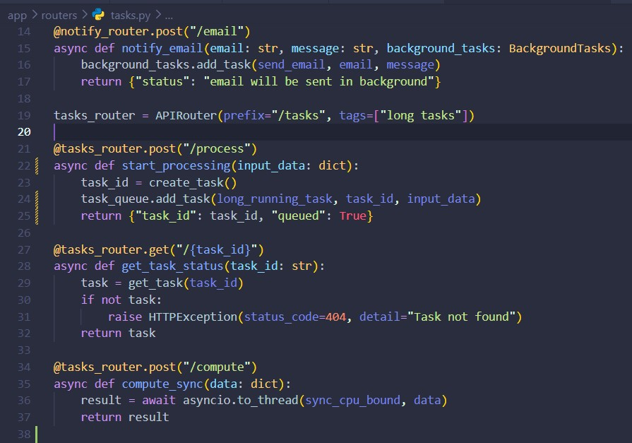   
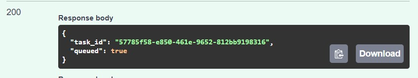   
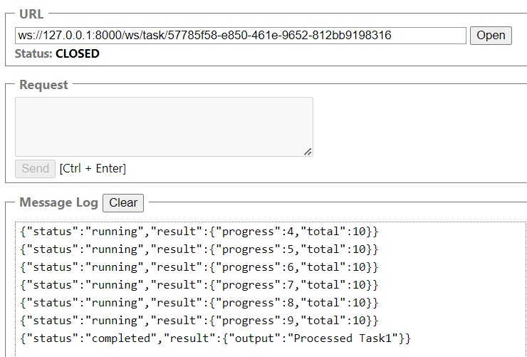   
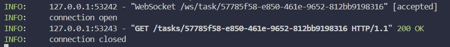   
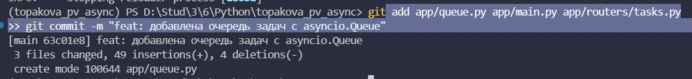   
### 6.2. Добавьте callback-уведомление
- Добавьте в запрос на создание задачи опциональное поле `callback_url`.
- После завершения задачи отправьте POST-запрос на этот URL с результатом (используйте `httpx.AsyncClient`).
- Обработайте ошибки отправки callback (логирование, повторные попытки с экспоненциальной задержкой).    
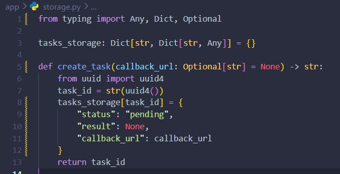   
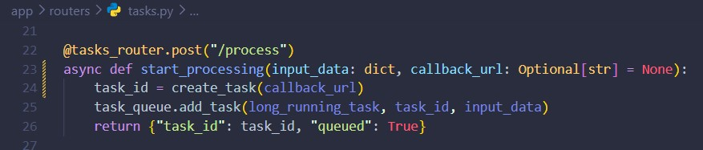   
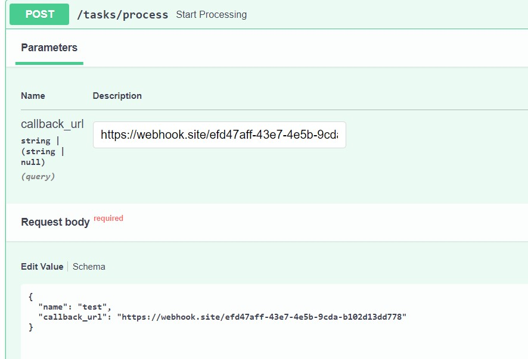   
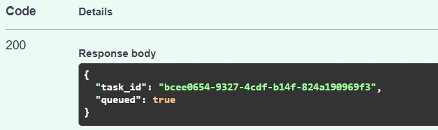   
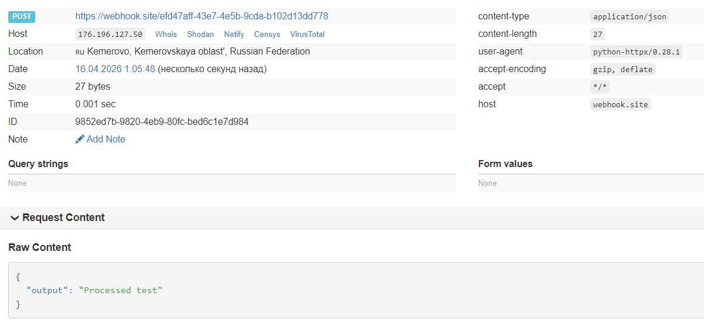   
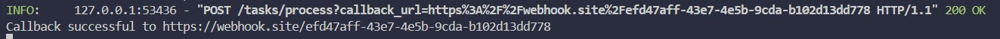   
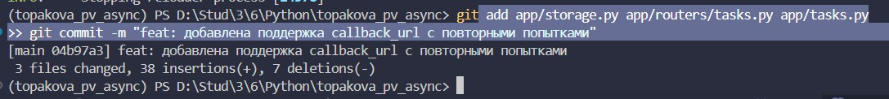   
### 6.3. Добавьте логирование
- Подключите стандартную библиотеку `logging` или `loguru`.
- Логируйте создание задачи, изменение статуса, завершение, ошибки, подключения WebSocket.   
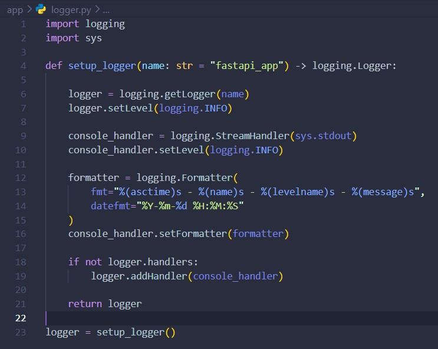   
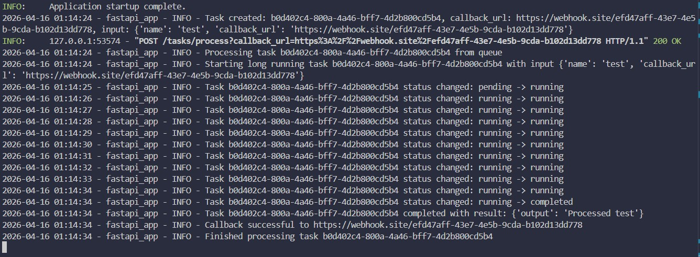   
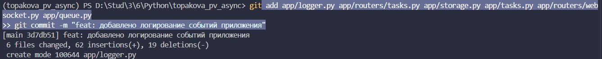   
### 6.4. Улучшите хранилище задач
- Замените словарь в памяти на Redis (установите redis и `redis` с поддержкой asyncio).
- Реализуйте автоматическое удаление старых задач через TTL (например, через 1 час).
- Обновите код для асинхронной работы с Redis.   
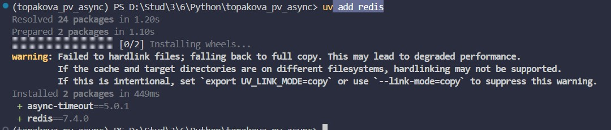   
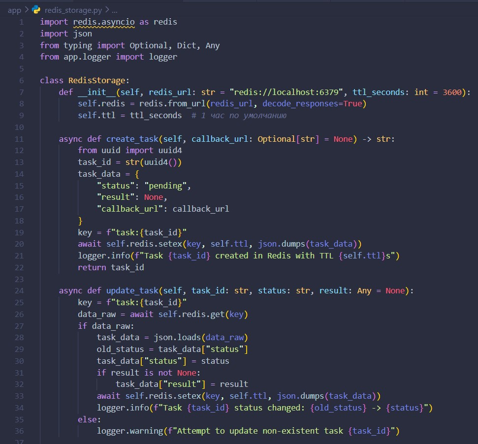   
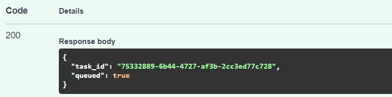   
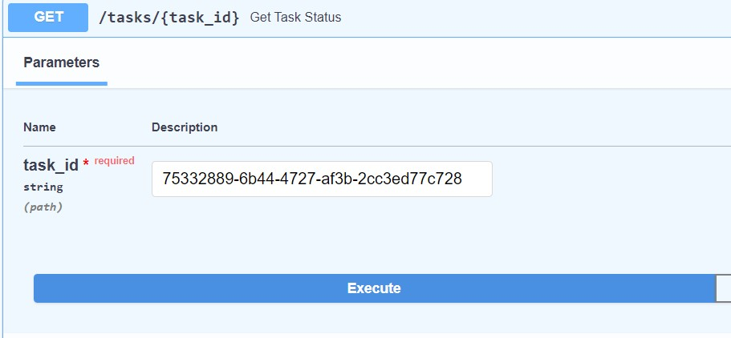   
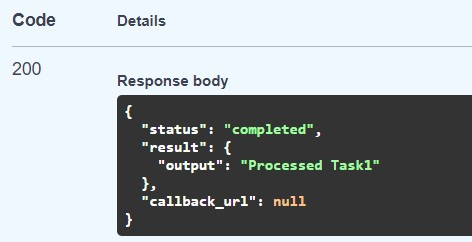   